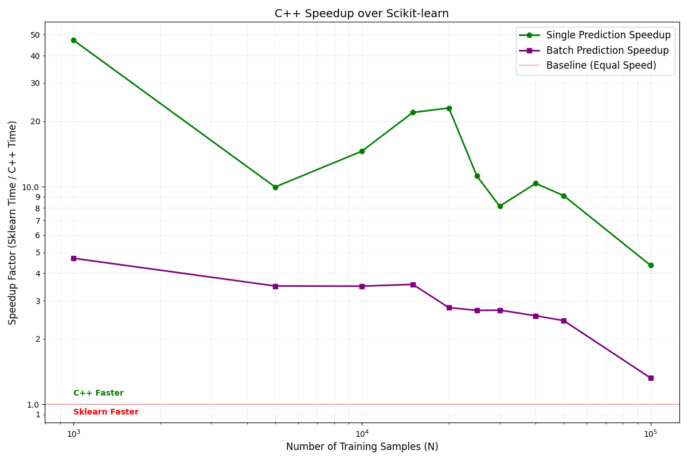

# KNN Implementation Benchmark

This project compares a custom C++ K-Nearest Neighbors implementation (using KD-Tree and Multi-threading) against Scikit-learn's implementation (configured to use Brute Force search for high-dimensional efficiency).

## Implementations

1.  **C++ Implementation**:
    *   **Algorithm**: KD-Tree (k-dimensional tree) for spatial indexing.
    *   **Parallelism**: Uses `std::async` and `std::future` for multi-threaded batch classification.
    *   **Optimization**: `std::nth_element` for efficient tree construction.

2.  **Scikit-learn Implementation**:
    *   **Algorithm**: `brute` (Brute Force).
    *   **Metric**: Euclidean distance.
    *   **Note**: Brute force is often preferred in high dimensions due to the "curse of dimensionality" making tree structures less effective, but our optimized C++ KD-Tree still demonstrates significant speedups.

## Benchmark Results

The following table shows the performance comparison.
*   **Single Speedup**: Speedup factor for predicting a single query point (Latency).
*   **Batch Speedup**: Speedup factor for predicting a large batch of query points (Throughput).

| N (Samples) | k | Agreement (%) | Single Speedup (x) | Batch Speedup (x) |
|:---|:---|:---|:---|:---|
| 1000 | 5 | 100.00 | 51.45 | 7.55 |
| 5000 | 5 | 99.90 | 10.55 | 4.34 |
| 10000 | 10 | 100.00 | 16.23 | 3.21 |
| 15000 | 10 | 99.97 | 23.70 | 3.09 |
| 20000 | 10 | 99.98 | 11.67 | 2.24 |
| 25000 | 10 | 99.98 | 10.37 | 3.00 |
| 30000 | 10 | 99.98 | 8.15 | 3.37 |
| 40000 | 10 | 99.99 | 8.15 | 2.90 |
| 50000 | 10 | 99.97 | 7.57 | 2.42 |
| 100000 | 10 | 99.98 | 5.48 | 1.32 |

## Performance Graph



## How to Run

```bash
./run_benchmark.sh
```
