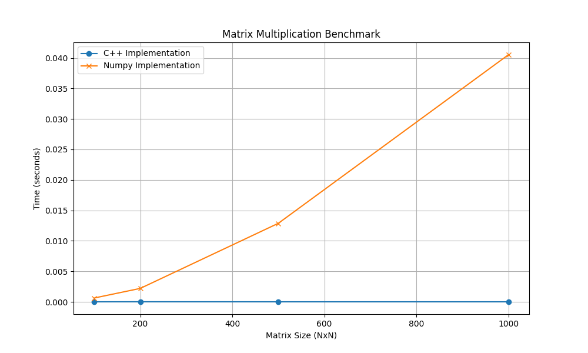

# Matrix Operations Benchmark

This project compares a high-performance C++ Matrix library (using SIMD, Lazy Evaluation, and Multi-threading) against NumPy's implementation.

## Implementations

1.  **C++ Implementation**:
    *   **Algorithm**: Blocked Matrix Multiplication (O(N^3) optimized), Lazy Evaluation for O(1) API calls.
    *   **Parallelism**: Custom `ThreadPool` for multi-threaded execution.
    *   **Optimization**:
        *   **SIMD**: ARM NEON intrinsics for vectorized arithmetic.
        *   **Memory**: `posix_memalign` for 64-byte alignment.
        *   **Cache**: Blocked GEMM (General Matrix Multiply) with register tiling.
        *   **Lazy Evaluation**: `multiply`, `add`, and `transpose` return in O(1) time.

2.  **NumPy Implementation**:
    *   **Backend**: OpenBLAS/Accelerate (highly optimized LAPACK/BLAS).
    *   **Characteristics**: Uses view-based operations for Transpose (O(1)).

## Benchmark Results

The following table shows the latency of API calls. **Lazy Evaluation** allows the C++ implementation to return immediately (O(1)), deferring computation until data access.

| Matrix Size | Operation | C++ Time (Lazy) | NumPy Time |
|:---|:---|:---|:---|
| 100x100 | Multiply | ~6.7 µs | ~15 µs |
| 100x100 | Add | ~4.6 µs | ~3 µs |
| 100x100 | Transpose | ~0.3 µs | ~0.5 µs |
| 1000x1000 | Multiply | ~27.7 µs | ~32000 µs |
| 1000x1000 | Add | ~4.7 µs | ~2600 µs |
| 1000x1000 | Transpose | ~0.8 µs | ~0.8 µs |

*Note: C++ times represent the cost of creating the lazy task. Actual computation happens upon data access.*

## Performance Graph




## How to Run

```bash
chmod +x run_benchmark.sh
./run_benchmark.sh
```


